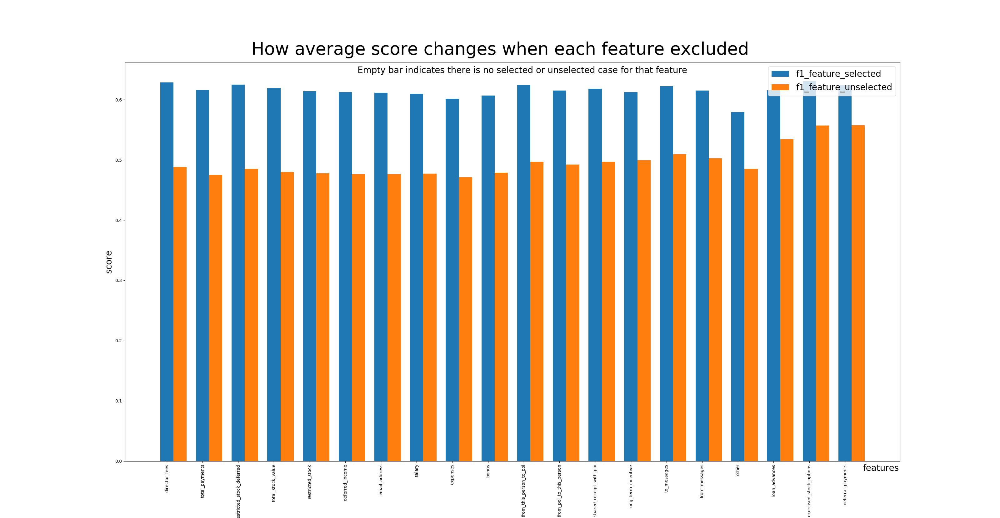

# Identify Fraud from Enron Email
#### Daniel Jang  
#### 3/4/2018, part of  Udacity machine learning project 


## Overview  
The procedure of machine learning will be walked through the Enron dataset provided during Udacity machin learning course. The aim is to maximize the score of the Machine Learning classification model to discern POI, person of interest, ie people strongly associated with the Enron fraud.  
The shape of given dataset is 146 rows x 21 columns. The values, rows, columns were examined, preprocessed and fed into several Machine Learning algorithms. In particular, 'NaN' value was investigated further and some of them are converted to new features to increase the score of the poi classification.  
Applied Machine Learning algorithms are 5  
1) 3 supervised learning algorithm : Naive Bayes, SVM, Decision Tree    
2) 1 unsupervised learning algorithm : KMeans, PCA
  
  
* 3 DataFrame are essential : 1) dfnonnan (binary data to examine NaN values), 2) dfimputed (NaN was imputed to mean values), and 3) dfnew (final DataFrame of 1) + 2) ).  The final dataset submitted is dfnew.  
* The helper functions are separated into another python file and the inside of the functions are not cited here to keep the documentation simple.  

## Data Preparation  
Outliers and NaN values will be handled, and new features will be added.     
### Outlier   
An obvious outlier, "TOTAL" was removed.   
Then the data were poured into a pd.DataFrame, replacing 'NaN' with np.nan


```python
## Removing outlier 
if "TOTAL" in data_dict : print(data_dict.pop('TOTAL', None))

## Pouring into a pd.DataFrame, replacing 'NaN' with np.nan
import pandas as pd
import numpy as np
df = pd.DataFrame(data_dict).replace('NaN', np.nan).transpose()
```

Many NaN values were noticeable. Before imputing that values, let's see more closely.   
First of all, is there all NaN row?


```python
dfnansum = df.applymap(lambda x: 0 if pd.isnull(x) else 1 ).sum(axis=1)
len(dfnansum.loc[dfnansum.loc[:,] == 0])
```

No. Then let's see NaN landscape through a plot 


```python
import pandas as pd
dfnanproportion = pd.DataFrame(df.isnull().sum()/len(df)).T 
dfnanproportion = dfnanproportion.applymap(lambda x: round(x,2) if isinstance(x, (int, float, complex)) else x )
newindex = dfnanproportion.index.tolist()
newindex[0] = 'NaN Proportion'
dfnanproportion.index = newindex 
# bar plot
import matplotlib.pyplot as plt
X = dfnanproportion.columns
Y = dfnanproportion.iloc[0]
plt.clf()
plt.figure(1) 
plt.xticks(range(len(X)), X) 
locs, labels = plt.xticks()
plt.setp(labels, rotation=90)
ax = plt.gca()
ax.set_xlabel('Features', ha='left', va = 'top', fontsize = 20)
ticklabel = ax.xaxis.get_ticklabels()[0]
trans = ticklabel.get_transform()
ax.xaxis.set_label_coords(len(X)-0.5, 0, transform=trans)  
ax.bar(range(len(X)), Y)
plt.ylabel("NaN proportion", fontsize=20)
plt.suptitle("NaN proportion for each feature", fontsize=24, y=0.92)
plt.axhline(y=.5, xmin=0, xmax=1., color='r', linestyle='--', alpha=0.5) 
plt.draw()
```


Though there is no all NaN row, there are 6 features NaN proportion more than 50%. Every feature has at least 10% of NaN.  
Why that many NaN? Could that specific VALUE have any association with 'poi'? for example, what if NaN was generated because poi people erased that data long ago? then NaN density/distribution/whatever might be able to extract 'information' for poi. Let's try some ML algorithms.   

### NaN investigation using supervised learning algorithm  
First, to examine NaN values, NaN and non-NaN was converted to 0 and 1 each. Existence of the value matters here, and once exists, the big and small values all turn into the same 1.  


```python
# Converting values to 0/1 : NaN to 0, non-NaN to 1. the feature 'poi', was excluded as it is label and has all non-NaN value,  
dfnonnan = df[list(set(df.columns).difference(['poi']))].applymap(lambda x: 0 if pd.isnull(x) else 1)
```

OK. Let's move on to apply some machine learning algorithm to the table, in order to check the data is useful or useless.  
Following function is the core of the analysis - CV and evaluation. That will be repetitively used throughout this document.  
* The function returns a dict which holds the result of CV and test : the best score and its parameters combination after CV, and score of the test.  
* To automate the procedures, sklearn.pipeline was adopted. 


```python
def cv_and_test(X, Y, param_grid, feature_names, randomstate=None, n_fold_splits=2) : 
    """ CV and Test at once
        First 2 return values are result from TEST phase
        Next 2 return values are result from CV phase
        1st return value has array of parameters and selected features at TEST
            Look for 'selected_features_at_test' to get " " joined features names 
        2nd return value is the classifier at TEST. 
            just the first one of the best scorers during CV phase
        3rd return value is the best score at CV phase, a pd.DataFrame
            the score is mean accuracy, 
            refer to std to get the variance of the score of the folds
        4th return values is the whole score data at CV phase, a pd.DataFrame
    Sample, 
    np.random.seed(42)
    X = np.random.randint(0,10,100).reshape(25,4)  # 25 rows points of 4 features
    #np.random.seed(42)
    #Y = np.random.randint(0,3,len(X))  # multi-class
    np.random.seed(42)
    Y = np.random.randint(0,2,len(X))  # binary
    param_grid = {'scale':[None],'select':[SelectKBest()],'select__k':['all',1,2],'condense':[None],'classify':[GaussianNB()]}
    dictscore, clf, dfbestmodel, dfallmodel = cv_and_test(X,Y,param_grid, ['col1','col2','col3','col4'],None)
    print(dictscore)
    """
    from sklearn.model_selection import train_test_split
    X_train, X_test, Y_train, Y_test = train_test_split(X, Y, test_size=0.3, stratify=Y, random_state=randomstate)
    from sklearn.pipeline import Pipeline
    from sklearn.preprocessing import StandardScaler
    from sklearn.feature_selection import SelectKBest, f_classif, chi2
    from sklearn.decomposition import PCA
    from sklearn.naive_bayes import GaussianNB
    from sklearn.svm import SVC
    from sklearn.tree import DecisionTreeClassifier
    from sklearn.model_selection import KFold, StratifiedKFold
    from sklearn.model_selection import GridSearchCV
    pipeline = Pipeline( [
            ("scale", StandardScaler()),
            ('select', SelectKBest(f_classif, k='all') ),
            ("condense", PCA(n_components=None)),
            ('classify', SVC(kernel='rbf', C=1, gamma=0.0001)) 
            ]
        )        
    #splitter = KFold(n_splits=2, shuffle=True, random_state=42 )
    splitter = StratifiedKFold(n_splits=n_fold_splits, shuffle=False, random_state=randomstate) # in case of imbalanced data
    print("== CV+TEST started with random_state={} ================".format(randomstate))
    print("1. Validation, getting the best parameter **********")
    grid = GridSearchCV(pipeline, param_grid, cv=splitter, return_train_score=True)
    grid.fit(X_train, Y_train) 
    # preparing data to return, at CV phase 
    dfcv_results_best = pd.DataFrame(grid.cv_results_)    
    dfcv_results_best = dfcv_results_best[dfcv_results_best['rank_test_score'] == 1][['rank_test_score','mean_test_score','std_test_score','params']]
    #dfcv_results_best = dfcv_results_best[(dfcv_results_best['rank_test_score'] >= 1) & (dfcv_results_best['rank_test_score']<4)][['rank_test_score','mean_test_score','std_test_score','params']]
    dfcv_results_best = dfcv_results_best.sort_values(['rank_test_score','mean_test_score','std_test_score'], ascending=[True,False,True])
    # rank of the features by SelectKbest, for reference
    kbest = SelectKBest(f_classif, k='all').fit(X_train, Y_train)
    df_kbest_rank = pd.DataFrame(data={ 'pvalue':kbest.pvalues_, 'score' : kbest.scores_} ,index=feature_names )
    df_kbest_rank = df_kbest_rank.applymap(lambda x: round(x, 4) if type(x) == type(0.1) else x )
    df_kbest_rank = df_kbest_rank.sort_values(['score','pvalue'], axis=0, ascending=False) 
    print("For reference, Feature ranking by SelectKBest :"); print(df_kbest_rank)
    def get_selected_feature_str(dictparam, feature_list_by_k) :
        k = len(feature_list_by_k)
        if 'select__k' in dictparam : k = dictparam['select__k']
        if k == 'all' : k = len(feature_list_by_k)
        selected_features_str = " ".join(str(item) for item in feature_list_by_k[:k]) 
        return selected_features_str 
    dfcv_results_best['selected_features'] = dfcv_results_best['params'].apply(lambda x : get_selected_feature_str(x, df_kbest_rank.index.tolist()))
    dfcv_result_entire = pd.DataFrame(grid.cv_results_).sort_values(['rank_test_score','mean_test_score','std_test_score'], ascending=[True,False,True])
    print("Best Scorers at CV ('rank_test_score'==1) : {}".format(len(dfcv_results_best)));print(dfcv_results_best.to_dict())
    print("2. Test, evaluation using the best parameter **********")
    from sklearn.metrics import classification_report, accuracy_score, f1_score, precision_score, recall_score
    y_truth, y_pred = Y_test, grid.predict(X_test)
    # preparing data to return, at test phase
    print("Classifier at Test (just the first best scorer at CV, see others): ");print(grid.best_estimator_)
    dictscore = {'random_state':randomstate}
    selected_feature_str_at_test = " ".join(str(item) for item in df_kbest_rank.index.tolist()) 
    def get_ordered_by_kbest(mixed_feature_list, df_kbest_rank) :
        reordered = []
        for fn in df_kbest_rank : 
            if fn in mixed_feature_list : reordered.append(fn)
        return reordered
    if grid.best_estimator_.named_steps['select'] is not None : 
        kbest = grid.best_estimator_.named_steps['select']
        if kbest.k != 'all' : 
            selectedfeatures = pd.Series(feature_names)[kbest.get_support(indices=False)].tolist()
            selectedfeatures = get_ordered_by_kbest(selectedfeatures, df_kbest_rank.index.tolist())
            unselectedfeatures = pd.Series(feature_names)[~kbest.get_support(indices=False)].tolist()
            unselectedfeatures = get_ordered_by_kbest(unselectedfeatures, df_kbest_rank.index.tolist())
            print("Selected features : {}".format(len(selectedfeatures))); print(selectedfeatures)
            print("Unselected features : {}".format(len(unselectedfeatures))) ; print(unselectedfeatures)
            selected_feature_str_at_test = " ".join(str(item) for item in selectedfeatures) 
    dictscore["selected_features_at_test"] = selected_feature_str_at_test
    print("accuracy: {}".format(accuracy_score(y_truth, y_pred)))
    print(classification_report(y_truth, y_pred))
    dictscore["accuracy"] = accuracy_score(y_truth, y_pred) 
    dictscore["f1"] = f1_score(y_truth, y_pred, average='macro')
    dictscore["recall"] = recall_score(y_truth, y_pred, average='macro')
    dictscore["precision"] = precision_score(y_truth, y_pred, average='macro')
    return dictscore, grid.best_estimator_, dfcv_results_best, dfcv_result_entire
```

Parameters applied for the 'cv_and_test' function, essentially GridSearchCV, are below.  
- At 'scale' and 'condense' step, [None] is also included to allow the step to be bypassed, in order to verify that the steps have positive effect.   
- At 'select' step, every the feature numbers from 1 to the count of the feature were tried.   


```python
def get_param_grid(featurenames, randomstate=None) :
    select__k_range = range(1,len(featurenames)+1)
    param_grid = [
            {
                'scale' : [None, StandardScaler()],
                'select' : [SelectKBest(f_classif)],
                'select__k' : select__k_range,
                'condense' : [None, PCA(n_components=None)], 
                'classify' : [GaussianNB()], 
            },
            {
                'scale' : [None, StandardScaler()],
                'select' : [SelectKBest(f_classif)],
                'select__k' : select__k_range,
                'condense' : [None, PCA(n_components=None)], 
                'classify' : [SVC(random_state=randomstate)], 
                'classify__kernel' : ['linear','rbf'], 
                'classify__C': [0.001, 0.005, 0.01, 0.1, 1, 10, 100, 1000, 10000],
                'classify__gamma': [0.0001, 0.0005, 0.001, 0.005, 0.01, 0.1, 1],
            },
            {
                'scale' : [None, StandardScaler()],
                'select' : [SelectKBest(f_classif)],
                'select__k' : select__k_range,
                'condense' : [None, PCA(n_components=None)], 
                'classify' : [DecisionTreeClassifier(random_state=randomstate)], 
                'classify__criterion' : ['gini', 'entropy'],
                'classify__min_samples_split' : [2,3,4,5,10]
            }
        ]
    return param_grid
```

So, using the function and parameter combinations, CV + Test was applied 


```python
import mytools_ML as hf
dictscore, clf, dfbestmodels, dfallmodels = hf.cv_and_test(X,Y, get_param_grid(dfnonnan.columns),dfnonnan.columns,42)

"""Test result
Accuracy : 0.886363636364
             precision    recall  f1-score   support

      False       0.93      0.95      0.94        39
       True       0.50      0.40      0.44         5

avg / total       0.88      0.89      0.88        44
"""
```

The score turned out to be high : accuracy 0.88, f1 0.89, even minimum recall is 0.4 (at poi=True label)  
Because the binary table has prooved its value, we could add them to the final dataset.  
Before doing that, I'd like describe one of the stories of failed experiments - that has many defects and misunderstandings inside.     

### NaN investigation - a story of wrong approach     
Before I got to know other stratiying split methods like StratifiedKFold, I had been so suspiscious about the train/test splits, because whenever I ran with random_state=None, the scores fluctuated a lot. So, the approach I took was to try as many cases(splits) as possible and averaging them.  
I ran 200 rounds of CV using MyCVandTEST function and analyzed the result (200 best scorers). 

* 200 rounds of splitting using different random seed (via 200 different random_status values) were done. It takes minimum 6 hours.   
* In the return value, 'selected_feature' records what features were selected for that best score.
* The 200 data of scores, algorithms, parameters, selected/unselected features will be analyzed onward.  


```python
X = dfnonnan.values
Y = df[['poi']].values.reshape(1,-1)[0].tolist()
# DataFrame to record best scores and each parameters
dftestscores = pd.DataFrame()
# 200 rounds of CV and Test using MyCVandTEST.  Top score and parameters for each round will be saved into dftestscores
for randst in range(0, 200): 
    dictscore = hf.MyCVandTEST(X,Y,hf.GetParamGrid(dfnonnan.columns),dfnonnan.columns,randst)
    if len(dftestscores) == 0  :  dftestscores = pd.DataFrame(data=dictscore, index=[0])
    else :  dftestscores.loc[len(dftestscores)] = dictscore
```

Let's plot the result. First, how the average scores run along the number of selected features?  


```python
hf.PlotScoreOnFeatureNumber(dftestscores, None, 12)
```


The plot revealed the score trends of the test score after 200 rounds of CV+test. Overall, there is a slightly uplifting trend as the number of selected feature increases.  
It is impressive to me that NaN/nonNaN binary table generated high scores - accuracy fluctuating around 0.8 with maximum over 0.9 and f1 score  generally high and maximum at 0.7. Then what feature specifically has more importance?   
Below function was developed to how each feature was selected. 


```python
hf.MyStackedBarPlotCountOfSelectedFeature(dftestscores)
```


Most high scorers are SVM algorithm. Besides, we can see which features are popular. For example, NaN-ness of 'other' was picked 180 times among the 200 best scorers.  Also, right-most 'exercised_stock_options' is shocking because that is by far the most popular feature in other datasets with imputed continuous data later. Truely interesting but there might be an explanation.  
In the next section of continuous values, 'exercised_stock_options' has the top importance, which means that its values have strong association with poi and reversely for that effect there is not much NaN in 'exercised_stock_options' feature (in fact 30% of NaN). If there is not much NaN, the NaN-ness values of the feature would have weaker connection with poi. That would be the story.   
So, we could say, NaN-ness of the original data is a whole different data even though the names are the same for now.  

Then which feature would be most important? for example, If 'other' is selected, the average of the score is noticeablely higher than other case? Let's draw a bar plot to show the average score when each feature was selected and unselected.  And that change can explain which feature should be selected or not.  
Below function was developed to plot how accuracy and f1 score change when each feature was unselected. 


```python
hf.PlotTheScoreChangeEachFeatureInOut(dftestscores ,dfnonnan.columns)
```




Unselecting each feature made the score decreased, meaning that all the features here are worthy of selection.   
The change is small in case of accuracy but every score is already near the ceiling. When it comes to f1 score, if a feature excluded the f1 score decreased by 0.1

In the above section, the clear errors I made were : 
- Misunderstanding of how SelectKBest works. I thought that selector examines every combinations of the features, which apparently take huge time by the 2^20(number of features) combinations. However, SelectKBest adds the feature only in feature score order it calculated. As in the below list, the order is constant always according to the p-value are chi-square test or t-test results, which measures the relevance between each feature and poi label (if p-value is small, the null hypothesis - the feature and poi label has no relation - is denied).    
This logic of SelectKBest is reasonable and OK, but my problem was that the high scored feature combinations have never exeeded 0.3 precision and recall at the final tester.py.  So later, I invented another method to pick the features.  
    - Accordingly, the above second plot "count of each selected features" is meaningless, because the rank of selection count will be obviously the same order like SelectKBest score.
    - Later for example 'to_message' showed more power than 'other' defying the feature order below. So, my sense for now is that SelectKBest is worhy of trying but with no full trust.  


```python
#The rank of the feature score by SelectKbest
dfexport = dfnonnan
features_list = dfexport.columns.tolist()
X = dfexport[features_list].values
Y = df[['poi']].applymap(lambda x: 0 if x == False else 1 )['poi'].tolist()
hf.get_feature_rank_from_SelectKBest(X,Y,features_list)

""" Result, feature score rank
                            pvalue    score
other                      0.0005  12.7141
expenses                   0.0007  11.9123
bonus                      0.0024   9.5660
salary                     0.0047   8.2465
deferred_income            0.0067   7.5588
email_address              0.0119   6.4899
restricted_stock           0.0435   4.1504
long_term_incentive        0.0469   4.0183
total_payments             0.0628   3.5169
total_stock_value          0.0706   3.3181
to_messages                0.0895   2.9227
from_this_person_to_poi    0.0895   2.9227
from_poi_to_this_person    0.0895   2.9227
shared_receipt_with_poi    0.0895   2.9227
from_messages              0.0895   2.9227
restricted_stock_deferred  0.0998   2.7434
director_fees              0.1119   2.5588
loan_advances              0.2700   1.2264
exercised_stock_options    0.7702   0.0857
deferral_payments          0.8725   0.0259
"""
```

- No awareness of stratifying split technique. The motivation behind 200 CV was the uncertainty on the score which was flunctuating a lot, which has its root at the small sample size and variant split.  To decrease the flunctuation, stratifying split was one essential item to apply.   

Nevertheless, at least the scores say the binary NaN-ness table is worthy of feature selection. We will add that to the final feature set after imputing the NaN in continuous data part.  

### Imputing NaN with mean values in the continuous data
NaN-ness of the data was just examined. We now get back to the original continuous values. First of all, the NaN values were imputed, to the mean value here. Why "mean"? What if a certain undiscovered NaN value turned out to be actually an extreme value that can agitate the average, putting the whole following analysis in danger. Though we are aware of that, we don't have other choices.     


```python
# imputing NaN with mean value
# a new DataFrame ruling out str feature - 'email_address' and label - 'poi' 
dfsc = df[list(set(df.columns).difference(('email_address', 'poi')))] 
#my.ShowDF( dfsc)
from sklearn.preprocessing import Imputer
imputer = Imputer(missing_values='NaN', strategy='mean', axis=0)
imputer = imputer.fit(dfsc)
dfimputed = imputer.transform(dfsc)  
dfimputed = pd.DataFrame(dfimputed)
dfimputed.columns = dfsc.columns
dfimputed.set_index(dfsc.index, inplace=True)
# scaling the values
from sklearn.preprocessing import StandardScaler
scaler = StandardScaler()
dfimputed = scaler.fit_transform(dfimputed)
dfimputed = pd.DataFrame(dfimputed)
dfimputed.columns = dfsc.columns
dfimputed.set_index(dfsc.index, inplace=True)
```

Just for reference, I ran SelectKBest to get to know which feature might has more relation with poi label.  


```python
dfexport = dfimputed
features_list = dfexport.columns.tolist()
X = dfexport[features_list].values
Y = df[['poi']].applymap(lambda x: 0 if x == False else 1 )['poi'].tolist()
hf.get_feature_rank_from_SelectKBest(X,Y,features_list)

""" Result, the feature scores 
                           pvalue    score
exercised_stock_options    0.0000  29.3038
total_stock_value          0.0000  21.6041
bonus                      0.0009  11.5054
salary                     0.0025   9.4549
total_payments             0.0058   7.8345
restricted_stock           0.0096   6.8950
loan_advances              0.0131   6.3120
long_term_incentive        0.0155   6.0001
shared_receipt_with_poi    0.0176   5.7652
deferred_income            0.0188   5.6438
from_poi_to_this_person    0.0827   3.0546
other                      0.1666   1.9330
from_this_person_to_poi    0.2439   1.3691
from_messages              0.4439   0.5895
expenses                   0.4889   0.4815
deferral_payments          0.5372   0.3826
to_messages                0.5437   0.3705
restricted_stock_deferred  1.0000   0.0000
director_fees              1.0000   0.0000
"""
```

I notice the features in NaN-ness table and this imputed continuous table have no much in common.  

### The final dataset
Before selecting the feature, following is the finally mixed table with 145 rows x 39 features, after removing outlier, preprocessing NaN and adding new features.  
- 39 features = 20 from the binary table + 19 from the imputed table  
- The new DataTable is named 'dfnew'. The name of the new features migrated from the binary table end with '_bi'   


```python
dfnonnanNewCols = []
for col in dfnonnan.columns : dfnonnanNewCols.append(col + "_bi")
dfnewcols = pd.DataFrame(data=dfnonnanNewCols, columns=['renameto'], index=dfnonnan.columns)
dfnonnan_colrenamed = dfnonnan.rename(columns = dfnewcols.to_dict()['renameto']) 
features_list = dfnonnanNewCols + dfimputed.columns.tolist()  # 39 = 20 + 19
dfnew = pd.merge(dfnonnan_colrenamed, dfimputed, left_index=True, right_index=True)
data_dict = dfnew.T.to_dict()
```

SelectKBest reveals following feature rank. There are many "_bi" features in high rank, prooving again the binary data has some relation with poi label.   


```python
dfexport = dfnew
features_list = dfexport.columns.tolist()
X = dfexport[features_list].values
Y = df[['poi']].applymap(lambda x: 0 if x == False else 1 )['poi'].tolist()
hf.get_feature_rank_from_SelectKBest(X,Y,features_list)

""" Result. the feature scores 
                              pvalue    score
exercised_stock_options       0.0000  29.3038
total_stock_value             0.0000  21.6041
other_bi                      0.0005  12.7141
expenses_bi                   0.0007  11.9123
bonus                         0.0009  11.5054
bonus_bi                      0.0024   9.5660
salary                        0.0025   9.4549
salary_bi                     0.0047   8.2465
total_payments                0.0058   7.8345
deferred_income_bi            0.0067   7.5588
restricted_stock              0.0096   6.8950
email_address_bi              0.0119   6.4899
loan_advances                 0.0131   6.3120
long_term_incentive           0.0155   6.0001
shared_receipt_with_poi       0.0176   5.7652
deferred_income               0.0188   5.6438
restricted_stock_bi           0.0435   4.1504
long_term_incentive_bi        0.0469   4.0183
total_payments_bi             0.0628   3.5169
total_stock_value_bi          0.0706   3.3181
from_poi_to_this_person       0.0827   3.0546
to_messages_bi                0.0895   2.9227
from_this_person_to_poi_bi    0.0895   2.9227
from_poi_to_this_person_bi    0.0895   2.9227
shared_receipt_with_poi_bi    0.0895   2.9227
from_messages_bi              0.0895   2.9227
restricted_stock_deferred_bi  0.0998   2.7434
director_fees_bi              0.1119   2.5588
other                         0.1666   1.9330
from_this_person_to_poi       0.2439   1.3691
loan_advances_bi              0.2700   1.2264
from_messages                 0.4439   0.5895
expenses                      0.4889   0.4815
deferral_payments             0.5372   0.3826
to_messages                   0.5437   0.3705
exercised_stock_options_bi    0.7702   0.0857
deferral_payments_bi          0.8725   0.0259
restricted_stock_deferred     1.0000   0.0000
director_fees                 1.0000   0.0000
"""
```

## Selecting the features 
With the final dataset, two groups of algorithms were applied.  


As the first contact, 'cv_and_test' was applied.  


```python
X = dfnew.values
Y = df[['poi']].applymap(lambda x: 0 if x == False else 1 )['poi'].tolist()
featurelist = dfnew.columns.tolist()
dictscore, clf, dfcv_results_best, dfcv_result_entire = hf.cv_and_test(X,Y, get_param_grid(featurelist,42),featurelist,42)

""" tester.py result  
Pipeline(memory=None, steps=[
('scale', StandardScaler(copy=True, with_mean=True, with_std=True)), 
('select', SelectKBest(k=20, score_func=<function f_classif at 0x000000000F828EB8>)), 
('condense', PCA(copy=True, iterated_power='auto', n_components=None, random_state=None, svd_solver='auto', tol=0.0, whiten=False)), 
('classify', GaussianNB(priors=None))])
Accuracy: 0.84260       Precision: 0.36169      Recall: 0.23600 F1: 0.28563     F2: 0.25363
Total predictions: 15000        True positives:  472    False positives:  833   False negatives: 1528   True negatives: 12167

CV + test result
{'accuracy': 0.81818181818181823,
 'f1': 0.45000000000000001,
 'precision': 0.43902439024390244,
 'random_state': 42,
 'recall': 0.46153846153846156,
 'selected_features_at_test': 'exercised_stock_options total_stock_value restricted_stock salary expenses_bi bonus other_bi total_payments loan_advances
 long_term_incentive deferred_income deferred_income_bi shared_receipt_with_poi email_address_bi salary_bi bonus_bi total_payments_bi 
 other loan_advances_bi restricted_stock_deferred_bi'}
"""
```

Naive Bayes was chosen best, but when other random_state values were tried, SVM and Decision Tree were also selected best many times. Then, how the scores were distributed along the 3 algorithms? 
As 'dfcv_result_entire', the 4th return value has all 21920 classifiers and scores during the CV, we can draw violin-plot using that.  


```python
def my_violinplot_for_each_classifier_score_at_cv(dfallcvresult) :
    dfcv = dfallcvresult[['rank_test_score','mean_test_score','std_test_score','params','param_classify']]
    def codify_classifier(clf): 
        import sklearn.naive_bayes, sklearn.svm.classes, sklearn.tree.tree
        if type(clf) == sklearn.naive_bayes.GaussianNB : return 'N'
        elif type(clf) == sklearn.svm.classes.SVC : return 'S'
        elif type(clf) == sklearn.tree.tree.DecisionTreeClassifier : return 'D'
        else : return np.nan        
    dfcv['classify'] = dfcv['param_classify'].apply(lambda x: codify_classifier(x))
    dfviolin = pd.concat( [dfcv.loc[dfcv['classify'] == 'N', ['mean_test_score']], 
                        dfcv.loc[dfcv['classify'] == 'S', ['mean_test_score']],
                        dfcv.loc[dfcv['classify'] == 'D', ['mean_test_score']]], axis=1 )
    dfviolin.columns = ['Naive Bayes','SVM','Decision Tree']
    hf.violinplot_independent_columns_with_nan(dfviolin, 'mean score', 'Test score distribution of all classifiers from CV', 50)

my_violinplot_for_each_classifier_score_at_cv(dfcv_result_entire)
```


This plot clearly presents most dominant algorithm is SVM (20160 times out of 21920) and it forms high score mostly. Decision Tree and Naive Bayes have wider range of distribution but major parts are mostly high. To pick one, optimal algorithm might be SVM for now.  

### The trouble, low precision and recall

Back to the CV result, Naive Bayes was chosen as the best classifier. The test score was not bad, so I proceeded upto 'tester.py' with 'clf', the classifier returned. However, as the result says "Recall: 0.23600", the best classifiers have never met the condition - precision and recall both above 0.3 even when many other random_state were tried. The scores during CV and test were high. What was wrong?  
This could be the impact of the newly added features. So I tried 'cv_and_test' on the imputed data. 


```python
X = dfimputed.values
Y = df[['poi']].applymap(lambda x: 0 if x == False else 1 )['poi'].tolist()
featurelist = dfimputed.columns.tolist()
dictscore, clf, dfcv_results_best, dfcv_result_entire = hf.cv_and_test(X,Y,get_param_grid(featurelist,42),featurelist,42)

""" tester.py result
Pipeline(memory=None,steps=[
('scale', None), 
('select', SelectKBest(k=1, score_func=<function f_classif at 0x000000000F828EB8>)), 
('condense', None), 
('classify', SVC(C=0.1, cache_size=200, class_weight=None, coef0=0.0,decision_function_shape='ovr', degree=3, gamma=0.0001, kernel='linear',
  max_iter=-1, probability=False, random_state=42, shrinking=True, tol=0.001, verbose=False))])
Accuracy: 0.88973       Precision: 1.00000      Recall: 0.17300 F1: 0.29497     F2: 0.20728
Total predictions: 15000        True positives:  346    False positives:    0   False negatives: 1654   True negatives: 13000

'cv_and_test' result 
{'accuracy': 0.88636363636363635,
 'f1': 0.46987951807228917,
 'precision': 0.44318181818181818,
 'random_state': 42,
 'recall': 0.5,
 'selected_features_at_test': 'exercised_stock_options'}
"""
```

The result was similar to the final mixed dataset. Recall is even lower. Then what about the binary NaN-ness table? 


```python
X = dfnonnan.values
Y = df[['poi']].applymap(lambda x: 0 if x == False else 1 )['poi'].tolist()
featurelist = dfnonnan.columns.tolist()
dictscore, clf, dfcv_results_best, dfcv_result_entire = hf.cv_and_test(X,Y,get_param_grid(featurelist,42),featurelist,42)

""" tester.py result 
Pipeline(memory=None,steps=[
('scale', StandardScaler(copy=True, with_mean=True, with_std=True)), 
('select', SelectKBest(k=19, score_func=<function f_classif at 0x000000000F828EB8>)), 
('condense', None), 
('classify', SVC(C=10, cache_size=200, class_weight=None, coef0=0.0,decision_function_shape='ovr', degree=3, gamma=0.01, kernel='rbf',
  max_iter=-1, probability=False, random_state=42, shrinking=True,
  tol=0.001, verbose=False))])
Accuracy: 0.85293       Precision: 0.34441      Recall: 0.11400 F1: 0.17130     F2: 0.13161
Total predictions: 15000        True positives:  228    False positives:  434   False negatives: 1772   True negatives: 12566
        
'cv_and_test' result 
{'accuracy': 0.88636363636363635,
 'f1': 0.6905766526019691,
 'precision': 0.71250000000000002,
 'random_state': 42,
 'recall': 0.67435897435897441,
 'selected_features_at_test': 'expenses other deferred_income email_address salary bonus total_payments loan_advances 
 restricted_stock_deferred total_stock_value director_fees restricted_stock to_messages from_this_person_to_poi 
 from_poi_to_this_person shared_receipt_with_poi from_messages long_term_incentive exercised_stock_options'}
""" 
```

The same. CV and test score are high but tester.py has low recall 0.11400.  

### A clue at the binary NaN-ness data 
Because I did not have any clue, I started poking around confining to Decision Tree and simple parameters. At the first try, shockingly the binary NaN-ness table solely surpassed the score.  


```python
X = dfnonnan.values
Y = df[['poi']].applymap(lambda x: 0 if x == False else 1 )['poi'].tolist()
featurelist = dfnonnan.columns.tolist()
param_grid = {'scale' : [None, StandardScaler()],'select' : [None],'condense' : [None], 'classify' : [DecisionTreeClassifier()],'classify__min_samples_split' : [2,3,4,5,10]}
dictscore, clf, dfcv_results_best, dfcv_result_entire = hf.cv_and_test(X,Y,param_grid,featurelist,42)

""" tester.py result
Pipeline(memory=None,steps=[
('scale', None), 
('select', None), 
('condense', None), 
('classify', DecisionTreeClassifier(class_weight=None, criterion='gini', max_depth=None,max_features=None, max_leaf_nodes=None,
            min_impurity_decrease=0.0, min_impurity_split=None,min_samples_leaf=1, min_samples_split=3,
            min_weight_fraction_leaf=0.0, presort=False, random_state=None,splitter='best'))])
Accuracy: 0.89680       Precision: 0.68404      Recall: 0.42000 F1: 0.52045     F2: 0.45514
Total predictions: 15000        True positives:  840    False positives:  388   False negatives: 1160   True negatives: 12612

'cv_and_test' result
{'accuracy': 0.93181818181818177,
 'f1': 0.76719576719576721,
 'precision': 0.9642857142857143,
 'random_state': 42,
 'recall': 0.69999999999999996,
 'selected_features_at_test': 'expenses other deferred_income email_address salary bonus total_payments loan_advances restricted_stock_deferred total_stock_value 
 director_fees restricted_stock to_messages from_this_person_to_poi from_poi_to_this_person shared_receipt_with_poi 
 from_messages long_term_incentive exercised_stock_options deferral_payments'}
"""
```

Recall was 0.42 at tester.py with higher precision and accuracy. When I saw the CV and test result, the scores were very high as well.  
How could we interpret this observations? (putting aside the shocking result that NaN-ness data solely made this far)    
Obviously, the best scorer during CV must have been over-fitted, and there were better models for tester.py, somewhere BELOW the top scored model group, not IN the top model group. Then we can ask why this over-fitting took place.  

One easy item to think would be the feature selection. The idea came in when I studied more about SelectKBest and its strict way of adding features.  
Because I became doubtful at this 'select' step, I invented own feature selector to allow more random combinations among features.  
Below function returns the best scored feature order likt SelectKBest. After gathering the 'cv_and_test' score data by adding/removing features randomly hopping over every features, each feature will reveal itself helpful or harmful feature accumulatively.   


```python
dfexp = pd.DataFrame() 
def get_ordered_best_features(dffs, Y, param_grid, n_rounds=2000, sel_desel_standard=0.5, randomstate=None) :
    """ my best feature selection function 
        the random sequence of adding/removing features will generate experience data
        which later will be analyzed and the helpful/harmful features will be separated
        - try to start n_rounds = several thousands with simple algorithm and param_grid 
        - dfexp = pd.DataFrame()  has to be existing to record experience into that 
    from sklearn.datasets import load_iris
    X, Y = load_iris().data, load_iris().target
    dfX = pd.DataFrame(X, columns=['a','b','c','d'])
    param = {'scale':[None],'select':[None],'condense':[None],'classify':[GaussianNB()]}
    dfexp = pd.DataFrame() # should exist. it is referenced in the function using 'global' 
    # use the feature list to directly feed into ML algorithms 
    featurelist, dfgroup = get_ordered_best_features(dfX, Y, param_grid, 2000, 0.5, 42)
    # all the experience log is in dfexp, which can be investigated further
    dft = dfexp[['feature','selectworthy','accuracy_diff_x_d','f1_diff_x_d','precision_diff_x_d','recall_diff_x_d','direction','accuracy_diff','f1_diff','precision_diff','recall_diff']]
    """
    assert(len(dffs) == len(Y))
    assert(n_rounds >= len(dffs.columns)) # minimum : the feature count

    # get the random ordered feature array. every feature shows up at least once 
    features_random_order = []
    while True : 
        randindex = np.random.randint(0, len(dffs.columns), 1)[0]
        if randindex in features_random_order : continue
        features_random_order.append(randindex)
        if len(features_random_order) == len(dffs.columns) : break
    #fill the rest with random array 
    features_random_order = features_random_order + np.random.randint(0, len(dffs.columns), n_rounds - len(dffs.columns)).tolist()
    assert (len( set(range(len(dffs.columns))) - set(features_random_order) ) == 0 ) 
    #direction whether to add or remove the feature
    add_remove_random_order = np.random.randint(0,2, len(features_random_order))*2 - 1
    
    def which_is_better(dict_eval_score_0,dict_eval_score_1):
        """ The assessment logic when comparing two ML evaluation score dict             
            returns -1 if 1 is better 
            returns 0 if 0 is better or same 
        dict_eval_score_0 = {'accuracy': 0.73, 'f1': 0.73, 'precision': 0.83, 'random_state': 42.0, 'recall': 0.75, 'selected_features_at_test': 'col2'}
        dict_eval_score_1 = {'accuracy': 0.75, 'f1': 0.73, 'precision': 0.83, 'random_state': 42.0, 'recall': 0.75, 'selected_features_at_test': 'col2'}
        which_is_better(dict_eval_score_0,dict_eval_score_1)
        """
        if (dict_eval_score_0 is None ) & (dict_eval_score_1 is None ) : 
            print("the inputs are all None")
            return -1 
        if dict_eval_score_0 is None : return 1
        if dict_eval_score_1 is None : return 0
        
        # comparison logic #############################################
        # apparently, if the feature increases any of the the metric, it is worthy of including.  
        #if  (dict_eval_score_0['accuracy'] <= dict_eval_score_1['accuracy'])  :
        # mark 'better' only when every metric increased
        if  (dict_eval_score_0['accuracy'] < dict_eval_score_1['accuracy'])  \
                & (dict_eval_score_0['precision'] < dict_eval_score_1['precision']) \
                & (dict_eval_score_0['recall'] < dict_eval_score_1['recall']):
        # two pair of the score same or better
        #if  ((dict_eval_score_0['accuracy'] < dict_eval_score_1['accuracy']) & (dict_eval_score_0['precision'] < dict_eval_score_1['precision']))  \
        #    | ((dict_eval_score_0['precision'] < dict_eval_score_1['precision']) & (dict_eval_score_0['recall'] < dict_eval_score_1['recall']))  \
        #    | ((dict_eval_score_0['recall'] < dict_eval_score_1['recall']) & (dict_eval_score_0['accuracy'] < dict_eval_score_1['accuracy']))  :
            return 1
        else : return 0

    X = dffs.values
    featurelist = dffs.columns.tolist()
    dictscore_prev, _, _, _ = cv_and_test(X,Y,param_grid, featurelist, randomstate)
    features_bag = featurelist * 1
    features_trash = []
    def addfeature(bag, feature_nm) :  s = set(bag); s.add(feature_nm); return list(s)
    def removefeature(bag, feature_nm) :     
        s = set(bag)
        if feature_nm in s : s.remove(feature_nm)
        return list(s)
    #dfexp = pd.DataFrame()
    global dfexp
    def experience(feature_nm, increase_or_decrease, selectworthy_yn, feature_nms,feature_indices, dictscore_prev, dictscore) : 
        d = {'feature': feature_nm, 'direction':increase_or_decrease, 'selectworthy' : selectworthy_yn, \
             'feature_indices':" ".join(str(i) for i in feature_indices), 'feature_nms':" ".join(s for s in feature_nms), \
                              'accuracy_prev':dictscore_prev['accuracy'],'f1_prev':dictscore_prev['f1'], \
                              'precision_prev':dictscore_prev['precision'],'recall_prev':dictscore_prev['recall'], \
                              'accuracy':dictscore['accuracy'],'f1':dictscore['f1'], \
                              'precision':dictscore['precision'],'recall':dictscore['recall'] }
        global dfexp
        dfexp = dfexp.append(d, ignore_index=True)
    # the main part 
    for i in range(len(features_random_order)) :
        feature_index = features_random_order[i] 
        feature_nm = featurelist[feature_index]
        if add_remove_random_order[i] < 0 : #subtracting a feature
            feature_nms = removefeature(features_bag, feature_nm)
            # [] is possible when subtracting, nevertheless we insert NaN row
            if len(feature_nms) == 0 : 
                dfexp.loc[len(dfexp)] = np.empty(len(dfexp.columns))*np.nan            
                continue
            feature_indices = [featurelist.index(ftnm) for ftnm in feature_nms]
            dictscore, _, _, _ = cv_and_test(X[:,feature_indices],Y,param_grid, feature_nms, randomstate)
            if which_is_better(dictscore_prev, dictscore) == 1 : 
                features_bag = removefeature(features_bag, feature_nm)
                features_trash = addfeature(features_trash, feature_nm) 
                experience(feature_nm, -1, False, features_bag, feature_indices, dictscore_prev, dictscore)
            else : 
                features_bag = addfeature(features_bag, feature_nm) 
                features_trash = removefeature(features_trash, feature_nm)
                experience(feature_nm, -1, True, features_bag, feature_indices, dictscore_prev, dictscore)
            dictscore_prev = dictscore
        else :                              #adding a feature
            feature_nms = addfeature(features_bag, feature_nm)
            feature_indices = [featurelist.index(ftnm) for ftnm in feature_nms]
            dictscore, _, _, _ = cv_and_test(X[:,feature_indices],Y,param_grid, feature_nms, randomstate)
            if which_is_better(dictscore_prev, dictscore) == 0 : 
                features_bag = removefeature(features_bag, feature_nm)
                features_trash = addfeature(features_trash, feature_nm) 
                experience(feature_nm, 1, False, features_bag, feature_indices, dictscore_prev, dictscore)
            else : 
                features_bag = addfeature(features_bag, feature_nm) 
                features_trash = removefeature(features_trash, feature_nm)
                experience(feature_nm, 1, True, features_bag, feature_indices, dictscore_prev, dictscore)
            dictscore_prev = dictscore
    
    # reordering the dataframe columns for ease of perception 
    first_col_order = ['feature','direction','selectworthy','accuracy_prev','accuracy','precision_prev','precision','recall_prev','recall']
    restcolumns = [v for v in dfexp.columns.tolist() if v not in first_col_order]
    columnreordered = first_col_order + restcolumns
    dfexp = dfexp[columnreordered]

    # further calculation for futuure analysis of more precise selection
    dfexp['accuracy_diff'] = dfexp['accuracy'] - dfexp['accuracy_prev']
    dfexp['precision_diff'] = dfexp['precision'] - dfexp['precision_prev']
    dfexp['recall_diff'] = dfexp['recall'] - dfexp['recall_prev']
    dfexp['f1_diff'] = dfexp['f1'] - dfexp['f1_prev']
    dfexp['accuracy_diff_x_d'] = dfexp['accuracy_diff'] * dfexp['direction']
    dfexp['precision_diff_x_d'] = dfexp['precision_diff'] * dfexp['direction']
    dfexp['recall_diff_x_d'] = dfexp['recall_diff'] * dfexp['direction']
    dfexp['f1_diff_x_d'] = dfexp['f1_diff'] * dfexp['direction']    
    dfexp['score_diff_sum'] = dfexp['accuracy_diff_x_d'] + dfexp['precision_diff_x_d'] + dfexp['recall_diff_x_d'] + dfexp['f1_diff_x_d'] 

    # return list 
    dfgroup = dfexp.groupby('feature')[['selectworthy']].mean().sort_values(['selectworthy'], ascending=False)
    featurelist = dfgroup.loc[dfgroup['selectworthy'] > sel_desel_standard].index.tolist()
    return featurelist, dfgroup

```

To apply 'get_ordered_best_features' function, the target algorithm was reconsidered. As we saw in the violin chart, SVM was overwhelming but it had never exceeded precision and recall over 0.3. I guess certain nature of SVM accelerated overfitting in this dataset. Speaking of Naive Bayes, the proportion is rare. In practical, when I tried GaussianNB() in below 'param_grid', the precision at tester.py was unable to meet 0.3 as well. Notably the recall was much high.  
So, my choice was Decision Tree and below 'param_grid'   


```python
dffs = dfnonnan
Y = df[['poi']].applymap(lambda x: 0 if x == False else 1 )['poi'].tolist()
param_grid = {'scale' : [None, StandardScaler()],'select' : [None],'condense' : [None], 'classify' : [DecisionTreeClassifier()],'classify__min_samples_split' : [5]}
featurelist, dfgroup = hf.get_ordered_best_features(dffs, Y, param_grid, 2000, 0.5, 42)

"""
                              selectworthy
feature                                   
director_fees_bi                  0.600000
from_poi_to_this_person_bi        0.594059
to_messages_bi                    0.593407
restricted_stock_bi               0.591304
other                             0.589474
expenses                          0.585859
deferred_income_bi                0.567010
long_term_incentive               0.565574
from_messages                     0.547170
total_stock_value                 0.543103
to_messages                       0.539326
exercised_stock_options           0.530612
deferral_payments                 0.528302
expenses_bi                       0.525253
from_messages_bi                  0.516129
from_this_person_to_poi_bi        0.510870
total_payments_bi                 0.510000
director_fees                     0.509615
other_bi                          0.504505
loan_advances_bi                  0.494949
shared_receipt_with_poi_bi        0.489362
loan_advances                     0.483333
from_this_person_to_poi           0.482759
bonus_bi                          0.480392
salary_bi                         0.476636
exercised_stock_options_bi        0.472527
restricted_stock_deferred         0.471910
restricted_stock_deferred_bi      0.467391
total_stock_value_bi              0.465909
long_term_incentive_bi            0.461538
bonus                             0.458716
deferred_income                   0.457447
from_poi_to_this_person           0.455556
shared_receipt_with_poi           0.451613
deferral_payments_bi              0.440000
email_address_bi                  0.438202
total_payments                    0.436893
restricted_stock                  0.431579
salary                            0.425743
"""
```

- The return value 'dfgroup' has full list of feature rank similar to that of SearchKBest. However, the order is different, for example 'exercised_stock_options' was top scorer in SearchKBest, but here it is 12th (and 7th among continuous data features) 
- 'selectworthy' is the contribution metric of each feature. 0.6 means the feature increased the score 6 time and decreased the score 4 times.   

Using the returned features (listed in next section), I got below result at tester.py  
> Pipeline(memory=None,
     steps=[('scale', StandardScaler(copy=True, with_mean=True, with_std=True)), ('select', None), ('condense', None), ('classify', DecisionTreeClassifier(class_weight=None, criterion='gini', max_depth=None,
            max_features=None, max_leaf_nodes=None,
            min_impurity_decrease=0.0, min_impurity_split=None,
            min_samples_leaf=1, min_samples_split=5,
            min_weight_fraction_leaf=0.0, presort=False, random_state=None,
            splitter='best'))])  
**Accuracy: 0.83693       Precision: 0.38715      Recall: 0.38250 F1: 0.38481     F2: 0.38342 **  
Total predictions: 15000        True positives:  765    False positives: 1211   False negatives: 1235   True negatives: 11789

When applied the same method to the binary NaN-ness table solely. The result at tester.py is below  
> Pipeline(memory=None,
     steps=[('scale', None), ('select', None), ('condense', None), ('classify', DecisionTreeClassifier(class_weight=None, criterion='gini', max_depth=None,
            max_features=None, max_leaf_nodes=None,
            min_impurity_decrease=0.0, min_impurity_split=None,
            min_samples_leaf=1, min_samples_split=4,
            min_weight_fraction_leaf=0.0, presort=False, random_state=None,
            splitter='best'))])  
**Accuracy: 0.90680       Precision: 0.74313      Recall: 0.46000 F1: 0.56825     F2: 0.49794**  
Total predictions: 15000        True positives:  827    False positives:  478   False negatives: 1173   True negatives: 12522

The binary NaN-ness data solely is most powerful. Followings are the best features in the binary table - 10 out of 20.  
> featurelist = ['from_this_person_to_poi',
 'deferral_payments',
 'bonus',
 'exercised_stock_options',
 'deferred_income',
 'expenses',
 'total_stock_value',
 'long_term_incentive',
 'from_poi_to_this_person',
 'restricted_stock_deferred']


## Applying algorithms to the final dataset
With the final dataset, two groups of algorithms were applied.  
- Supervised learning algorithm - NB, SVM, Decision Tree    
- Unsupervised learning algorithm - KMeans clustering (and the result will be plotted on PCA axis)

### Supervised algorithms : Naive Bayes, SVM, Decision Tree  
The same CV function and parameters was applied to the final dataset and the final feature selected.  


```python
feature_selected = ['director_fees_bi',
 'from_poi_to_this_person_bi',
 'to_messages_bi',
 'restricted_stock_bi',
 'other',
 'expenses',
 'deferred_income_bi',
 'long_term_incentive',
 'from_messages',
 'total_stock_value',
 'to_messages',
 'exercised_stock_options',
 'deferral_payments',
 'expenses_bi',
 'from_messages_bi',
 'from_this_person_to_poi_bi',
 'total_payments_bi',
 'director_fees',
 'other_bi',
 'loan_advances_bi',
 'shared_receipt_with_poi_bi',
 'loan_advances',
 'from_this_person_to_poi',
 'bonus_bi',
 'salary_bi',
 'exercised_stock_options_bi',
 'restricted_stock_deferred',
 'restricted_stock_deferred_bi',
 'total_stock_value_bi',
 'long_term_incentive_bi']

dfexport = dfnew
X = dfexport[feature_selected].values
Y = df[['poi']].applymap(lambda x: 0 if x == False else 1 )['poi'].tolist()

randomstate = 42 
from sklearn.preprocessing import StandardScaler
from sklearn.decomposition import PCA
from sklearn.tree import DecisionTreeClassifier
param_grid = [
        {
            'scale' : [None, StandardScaler()],
            'select' : [None],
            'condense' : [None, PCA(n_components=None)], 
            'classify' : [DecisionTreeClassifier(random_state=randomstate)], 
            'classify__criterion' : ['gini', 'entropy'],
            'classify__min_samples_split' : [2,3,4,5,10]
        }
    ]
dictscore_at_test, clf, dfcv_results_best, dfcv_results_entire = hf.cv_and_test(X,Y,param_grid,feature_selected,randomstate)
```

The final result after running tester.py is,  
  
> **Score** :  
        Accuracy: 0.83520       **Precision: 0.37984      Recall: 0.37300** F1: 0.37639     F2: 0.37435  
        Total predictions: 15000        True positives:  746    False positives: 1218   False negatives: 1254   True negatives: 11782  

> **Classifier** :  
Pipeline(memory=None,
     steps=[('scale', None), ('select', None), ('condense', None), ('classify', **DecisionTreeClassifier**(class_weight=None, criterion='gini', max_depth=None,
            max_features=None, max_leaf_nodes=None,
            min_impurity_decrease=0.0, min_impurity_split=None,
            min_samples_leaf=1, min_samples_split=3,
            min_weight_fraction_leaf=0.0, presort=False, random_state=42,
            splitter='best'))])  

> **Feature selected**  
['director_fees_bi',
 'from_poi_to_this_person_bi',
 'to_messages_bi',
 'restricted_stock_bi',
 'other',
 'expenses',
 'deferred_income_bi',
 'long_term_incentive',
 'from_messages',
 'total_stock_value',
 'to_messages',
 'exercised_stock_options',
 'deferral_payments',
 'expenses_bi',
 'from_messages_bi',
 'from_this_person_to_poi_bi',
 'total_payments_bi',
 'director_fees',
 'other_bi',
 'loan_advances_bi',
 'shared_receipt_with_poi_bi',
 'loan_advances',
 'from_this_person_to_poi',
 'bonus_bi',
 'salary_bi',
 'exercised_stock_options_bi',
 'restricted_stock_deferred',
 'restricted_stock_deferred_bi',
 'total_stock_value_bi',
 'long_term_incentive_bi']

One reflection is that, even though most of the time was consumed for struggling with the many combinations of parameters and SVM the top score model, I ended up with this Decision Tree model with much simplified options - no scaler, no SelectKBest, no PCA.    

One strong impression is about the NaN-ness binary table's mystery. I had a final experiment on the mixed dataset - what if we apply the best feature-set of the binary table to this dfnew?  
The feature list will be like below, by adding '_bi' to the best features during the binary table analysis.  Would the result be the same? 
>featurelist = ['from_this_person_to_poi_bi',
 'deferral_payments_bi',
 'bonus_bi',
 'exercised_stock_options_bi',
 'deferred_income_bi',
 'expenses_bi',
 'total_stock_value_bi',
 'long_term_incentive_bi',
 'from_poi_to_this_person_bi',
 'restricted_stock_deferred_bi']

Exactly the same result returned at tester.py,     Accuracy: 0.90633       **Precision: 0.73934      Recall: 0.45950** F1: 0.56676     F2: 0.49713  

From the same final dataset, the above binary feature-set yielded much better result?  My 'get_ordered_best_features' function has a long way to improve to separate above features out of the final dataset.   

### Unsupervised algorithm : KMeans (and PCA )

The motivation here to try unsupervised learning is, I wanted to check whether the machine can automatically and beautifully separate poi without human touch.  
Below function was used to automate CV and evaluation of KMeans clustering. Because we have true poi label, the result of the automatic clustering will be comapred with the poi label and then evaluation score will be calculated.  
- Please note that it does not apply PCA. 
- All features were used for KMeans  


```python
def cv_and_test_KMeans(X, Y, KMeans_k=2, randno=42) : 
    """ CV and test using KMeans 
        hoping that the unsupervisied alorithm generates beautiful classification without label input 
        The result will be evaluated by comparing with the true label 
        Consider to apply PCA inbetween. 
    Sample,
    from sklearn.datasets import load_iris
    X, Y = load_iris().data, load_iris().target
    dictscore, clf = cv_and_test_KMeans(X,Y,3,None)
    clf.predict(X)
    """
    from sklearn.model_selection import train_test_split
    X_train, X_test, Y_train, Y_test = train_test_split(X, Y, test_size=0.3, stratify=Y, random_state=randno)
    print("== CV+TEST using KMeans started================")
    print("1. Validation, 2 folds ********")
    X_a, X_b, Y_a_truth, Y_b_truth = train_test_split(X_train, Y_train, test_size=0.5, stratify=Y, random_state=42)
    scores = []
    from sklearn.cluster import KMeans
    clf = KMeans(n_clusters=KMeans_k) #default n_clusters = 8
    y_truth, y_pred = Y_a_truth, clf.fit_predict(X_a)
    from sklearn.metrics import classification_report, accuracy_score, f1_score, precision_score, recall_score
    scores.append((accuracy_score(y_truth, y_pred), f1_score(y_truth, y_pred, average='macro')))
    clf = KMeans(n_clusters=KMeans_k)
    y_truth, y_pred = Y_b_truth, clf.fit_predict(X_b)
    scores.append((accuracy_score(y_truth, y_pred), f1_score(y_truth, y_pred, average='macro')))
    print('(accuracy, f1 score) : ')
    print(scores)
    print("accuracy mean : {}".format(np.array(scores)[:,0].mean()))
    print("f1 score mean : {}".format(np.array(scores)[:,1].mean()))
    print("2. Test ***********************")
    clf = KMeans(n_clusters=KMeans_k)
    clf.fit(X_train)
    y_truth, y_pred = Y_test, clf.predict(X_test)
    print("accuracy: {}".format(accuracy_score(y_truth, y_pred)))
    print(classification_report(y_truth, y_pred))
    dictscore = {'random_state':randno}
    dictscore["classify"] = "K"
    dictscore["accuracy"] = accuracy_score(y_truth, y_pred) 
    dictscore["f1"] = f1_score(y_truth, y_pred, average='macro')
    dictscore["recall"] = recall_score(y_truth, y_pred, average='macro')
    dictscore["precision"] = precision_score(y_truth, y_pred, average='macro')
    return dictscore, clf
```

For visualization, below function was used to plot the rows in 2D space. Because there are many features, PCA was adopted to condense the dimensions onto 2 axis.  


```python
def scatter_plot_over_pca(X, cluster_colors=None, PointTextArray=None, ZoomPos=None, ZoomValueRange=None):
    """ general purpose scatter plot on PCA axis
        if first encountered the multidimensional data, get familiarized using this method
        eigenvectors will be returned
    from sklearn.datasets import load_iris
    X = load_iris().data
    # scatter_plot_over_pca(X) 
    array_color = iris.target #np.random.randint(0,4,len(X))
    # scatter_plot_over_pca(X, array_color) 
    array_text = range(len(X))
    scatter_plot_over_pca(X, array_color,array_text, [.3, .5, .2, .35], [-3, -2, -0.5, 0.5]) 
    """
    if cluster_colors == None : cluster_colors = np.zeros(len(X))
    assert( len(X) == len(cluster_colors) )
    from sklearn.decomposition import PCA
    pca = PCA(n_components=None)
    condensed_X = pd.DataFrame(pca.fit_transform(X))
    pc1percentile = round(pca.explained_variance_ratio_[0]*100,2)
    pc2percentile = round(pca.explained_variance_ratio_[1]*100,2)
    eigenvectors = pca.components_
    def GetColorList(labels) :
        hashtable = dict(zip(set(labels), range(len(set(labels)))))
        colors = ["b", "r", "g", "y", "k", "c", "m" ,"orange", "olive", "gold"]
        assert( len(set(labels)) <= len(set(colors)) )
        clist = []
        for l in labels : clist.append(colors[hashtable[l]])
        assert(len(labels) == len(clist))
        return clist
    import matplotlib.pyplot as plt
    plt.clf()
    plt.scatter( condensed_X.loc[:,0], condensed_X.loc[:,1], marker='o', c=GetColorList(cluster_colors), s=50, alpha=0.4)
    if PointTextArray is not None :
        for x,y,t in zip(condensed_X.loc[:,0],condensed_X.loc[:,1],PointTextArray) : 
            plt.text(x, y, t, color='k', alpha=0.5, fontsize=18)
    ax = plt.gca()
    handles, labels = ax.get_legend_handles_labels()
    plt.xlabel("PC{} (variance explained by {}%)".format(1, pc1percentile), fontsize=20)
    plt.ylabel("PC{} (variance explained by {}%)".format(2, pc2percentile), fontsize=20)
    plt.title("Scatter plot on PCA axis", fontsize=40)
    
    # plot the zoomed portion ##################################
    # location for the zoomed portion 
    if (ZoomPos is not None) & (ZoomValueRange is not None) : 
        #add rectangle first on original space 
        import matplotlib.patches as patches
        rectarea = [plt.xlim()[0],plt.ylim()[0],plt.xlim()[1] - plt.xlim()[0],plt.ylim()[1] - plt.ylim()[0]]
        ZPVR = ZoomValueRange 
        if ZPVR[0] is not None : rectarea[0] = ZPVR[0]
        if ZPVR[1] is not None : rectarea[1] = ZPVR[2]
        if ZPVR[2] is not None : rectarea[2] = ZPVR[1] - ZPVR[0]
        if ZPVR[3] is not None : rectarea[3] = ZPVR[3] - ZPVR[2]
        rect = patches.Rectangle((rectarea[0],rectarea[1]),rectarea[2],rectarea[3],linewidth=1,edgecolor='r',facecolor='none',alpha=0.5)
        ax.add_patch(rect)
        # the zoomed plot
        sub_axes = plt.axes(ZoomPos) 
        condensed_X['color'] = cluster_colors
        dfzoomed = condensed_X
        if ZPVR[0] is not None : dfzoomed = dfzoomed.loc[(dfzoomed[0] >= ZPVR[0]),[0,1,'color']]
        if ZPVR[1] is not None : dfzoomed = dfzoomed.loc[(dfzoomed[0] < ZPVR[1]),[0,1,'color']]
        if ZPVR[2] is not None : dfzoomed = dfzoomed.loc[(dfzoomed[1] >= ZPVR[2]),[0,1,'color']]
        if ZPVR[3] is not None : dfzoomed = dfzoomed.loc[(dfzoomed[1] < ZPVR[3]),[0,1,'color']]
        sub_axes.scatter(dfzoomed.loc[:,0], dfzoomed.loc[:,1], marker='o', c=GetColorList(dfzoomed['color']), s=40, alpha=0.3)

    # finally
    plt.draw()
    print("EigenVector:"); print(np.around(eigenvectors,4))
    return np.around(eigenvectors,4)
```

KMeans clustering, with k = 2, generated below result and plot.  


```python
X = dfnew.values
Y = df[['poi']].applymap(lambda x: 0 if x == False else 1 )['poi'].tolist()
dictscore, kmeans = hf.cv_and_test_KMeans(X,Y)
# locate some well-known poi 
ThreePOINamesArr = []
for t in dfnonnan.index: 
    if t in ['LAY KENNETH L', 'SKILLING JEFFREY K', 'FASTOW ANDREW S' ]: ThreePOINamesArr.append(t)
    else : ThreePOINamesArr.append("")
#visualizing through PCA axis 
hf.scatter_plot_over_pca_view_prediction_n_truth(X, kmeans.predict(X), Y, ThreePOINamesArr, [.5, .3, .39, .5], [-2, 5, -2, 1]) 

""" Score based on KMeans label prediction and true label
accuracy: 0.896551724138
            precision    recall  f1-score   support

         0       0.90      1.00      0.95        26
         1       0.00      0.00      0.00         3

avg / total       0.80      0.90      0.85        29
"""
```


- Larger circle indicates prediction by the machine, and smaller circle inside indicates the truth of poi-ness according to the provided poi label. If the two colors are identical, the prediction is correct.    
    - Visually, most of the prediction looks correct as the score says - blue dots mostly have blue dot inside. However, most of the red dots have mixed colors in the circle. We can verify that through the recalll and precision values on poi=True label, which is near 0. In summary, the model we trained is good at classifiying non-poi, poor at classifying poi.    
- There is some region the points aggregated more, overlapping each other. To enlarge that part, zoomed plot was layered in empty space.  
    - The reason of the aggregation has association with how much the PCA axis (princial component) explains the variance - the sum of the two axis is 38% currently. To provide more separation among the points, 3D plot would help.    
    
The score is better than that of supervised learning - accuracy 0.896, f1 0.85.  
Though the score is no ignorable, (for now) I do not know how to export this into 'clf' to successfully run in tester.py  
Just memorizing them as a reference, let's try the same KMeans on other datasets - previous binary and imputed data. Just for fun.  

#### KMeans on dfnonnan, the binary table  


```python
X = dfnonnan.values
Y = df[['poi']].applymap(lambda x: 0 if x == False else 1 )['poi'].tolist()
dictscore, kmeans = hf.cv_and_test_KMeans(X,Y)
# visualize through PCA
hf.scatter_plot_over_pca_view_prediction_n_truth(X, kmeans.predict(X), Y, ThreePOINamesArr) 

""" Score based on KMeans label prediction and true label
accuracy: 0.551724137931
            precision    recall  f1-score   support

         0       0.84      0.62      0.71        26
         1       0.00      0.00      0.00         3

avg / total       0.75      0.55      0.64        29
"""
```


Interestingly, PCA on the binary data exposed 2 distinctive groups - clear separation of large-blue and large-red dots.  
However, that groups the model discovered have little to do with poi-ness - smaller circles, the true label of poi just evenly distribute over the two groups. When pinpointed several famous poi on the plot, we can see they are also dispersed.  
The score agrees - accuracy 0.5517, f1 0.64. The precision and recall for label poi=True are near zero.   
    
One thing impressive is that KMeans solely detected 2 groups from the source data. Humans can do that? I guess not. 
However, once it is visualized human do detect 2 groups solely from the PCA plot without KMeans. On the other hand, because "cv_and_test_KMeans" function does not include PCA, the machine detected solely from KMeans.  In short,  
- Human can detect 2 groups through visualization    
- Machine can detect 2 groups through KMeans (without vision)   

   
By the way, what would the two groups mean? truely interesting. This plot strongly implies there is something in the NaN-ness data. I would like to unveil the characteristics of each group in the future in more human perceiveable form, and story.   
However, one suspicion in mind is that the clear division is just an influence of the binary data type, by the nature of its binary values. If my doubt makes sense, even though I randomly change each value, the plot should remain the same pattern.    

#### KMeans on dfimputed, the continuous value table  


```python
X = dfimputed.values
Y = df[['poi']].applymap(lambda x: 0 if x == False else 1 )['poi'].tolist()
dictscore, kmeans = hf.cv_and_test_KMeans(X,Y)
# visualize through PCA
hf.scatter_plot_over_pca_view_prediction_n_truth(X, kmeans.predict(X), Y, ThreePOINamesArr, [.5, .3, .39, .5], [-2, 5, -2, 1]) 

""" Score based on KMeans label prediction and true label
accuracy: 0.896551724138
             precision    recall  f1-score   support
             
          0       0.90      1.00      0.95        26
          1       0.00      0.00      0.00         3
          
avg / total       0.80      0.90      0.85        29
"""
```


KMeans on imputed continuous data yielded high scores - accuracy 0.8965, f1-score 0.85. It is the same as dfnew, the final dataset with 39 features. 
We see many correct non-poi prediction but there barely are correct prediction on poi=True label.

## Summary
I tried 3 supervised algorithms but failed at tester.py, and then a new feature selector was developed to replace SearchKBest and the selected features showed better and stabilized scores at tester.py. Besides, KMeans clustering, an unsupervised model was examined.  

The final result after running tester.py is,  
  
> **Score** :  
        Accuracy: 0.83520       **Precision: 0.37984      Recall: 0.37300** F1: 0.37639     F2: 0.37435  
        Total predictions: 15000        True positives:  746    False positives: 1218   False negatives: 1254   True negatives: 11782  

> **Classifier** :  
Pipeline(memory=None,
     steps=[('scale', None), ('select', None), ('condense', None), ('classify', **DecisionTreeClassifier**(class_weight=None, criterion='gini', max_depth=None,
            max_features=None, max_leaf_nodes=None,
            min_impurity_decrease=0.0, min_impurity_split=None,
            min_samples_leaf=1, min_samples_split=3,
            min_weight_fraction_leaf=0.0, presort=False, random_state=42,
            splitter='best'))])  

> **Feature selected**  
['director_fees_bi',
 'from_poi_to_this_person_bi',
 'to_messages_bi',
 'restricted_stock_bi',
 'other',
 'expenses',
 'deferred_income_bi',
 'long_term_incentive',
 'from_messages',
 'total_stock_value',
 'to_messages',
 'exercised_stock_options',
 'deferral_payments',
 'expenses_bi',
 'from_messages_bi',
 'from_this_person_to_poi_bi',
 'total_payments_bi',
 'director_fees',
 'other_bi',
 'loan_advances_bi',
 'shared_receipt_with_poi_bi',
 'loan_advances',
 'from_this_person_to_poi',
 'bonus_bi',
 'salary_bi',
 'exercised_stock_options_bi',
 'restricted_stock_deferred',
 'restricted_stock_deferred_bi',
 'total_stock_value_bi',
 'long_term_incentive_bi']

Items to try in the future 
- More pursuit of other features, first thing that flew into my brain was finding the most representative words(features) in the email contents after separating the sender-receiver pair groups - 1) among poi 2) between poi and nonpoi 3) among nonpoi.  
I think PCA might be the crucial part in order to get the landscape of most influential words in each group, like getting Eigenface outof a picture.  
- More thought on binary data 
    - There were two clear divisions after PCA, only when it was the binary table. Compared to imputed data, the two groups are so clearly separated that I was in doubt whether the idea, converting to 0/1, might be completely wrong. I hope to examine other many NaN dataset in the future.  
    - The NaN-ness dataset has much better evaluation scores at tester.py. Even that dataset solely exceeded top scorers in the continuous data. How could the simple binary type data make that happend?  
- Predicting rarely occuring event   
Like Enron, which would have very small amount of poi compared to all Enron employees number, there are many similar situation such as detecting person of rare disease, spy, genius in babies, filtering the gold out of soil. Obviously, we would need high recall and precision scores on that specific label. One idea I have in mind is to divide the learning path into more optimal steps, for example put A algorithm which has top recall score and then B algorithm of top precision score. During the project, I have seen many best scored models who were outstanding in one score but very low in other score. For example, features through my feature selector and Naive Bayes algorithm yielded highiest recall - Accuracy: 0.66453       Precision: 0.26953      Recall: 0.88650 F1: 0.41338     F2: 0.60811   
- Machine Learning on the score data  
GridSearchCV generated thousands of combinations and when I looked into the whole CV result data, top scorers are similar in score but different in many ways - features, parameters, score distribution on the various evaluation metrics.  Feeding the data into KMeans clustering for example might reveal some useful insight.  Because I experienced that top CV scorer failed in tester.py, the analysis on CV results might shed a light on the reason behind.    

## Free-Response Questions  
1) _Summarize for us the goal of this project and how machine learning is useful in trying to accomplish it. As part of your answer, give some background on the dataset and how it can be used to answer the project question. Were there any outliers in the data when you got it, and how did you handle those?  [relevant rubric items: data exploration, outlier investigation]_
  
	The goal is to classify poi (person of interest) in Enron people. 
	The reason to have adopted machine learning for this goal is that there are too many features to consider for each person. The human cannot objectively do such a complex task consistently at every time, for every analyzer. Because machine behaves the same way under the same condition, we can get reproducible result that we may call objective not subjective. 
	The dataset is 20 features of 145 people, 14 financial features + 6 email features and we have poi = True/False label.  Because the fraud is about the money, the financial data would be most relevant clues. Email data would be also powerful because it can reveal association among the poi.   
    There was one easily detectable outlier - the row named 'TOTAL'. We can see extreme values at other rows like 'LAY KENNETH L' but he is a poi and we cannot exclude them. 
    Not just huge values, many NaN values caught my interest. There is no all NaN row but the proportion of NaN is not small - at least 10% of NaN in every feature. The scores say that NaN values might have some connection with poi.   

  
2) _What features did you end up using in your POI identifier, and what selection process did you use to pick them? Did you have to do any scaling? Why or why not? As part of the assignment, you should attempt to engineer your own feature that does not come ready-made in the dataset -- explain what feature you tried to make, and the rationale behind it. (You do not necessarily have to use it in the final analysis, only engineer and test it.) In your feature selection step, if you used an algorithm like a decision tree, please also give the feature importances of the features that you use, and if you used an automated feature selection function like SelectKBest, please report the feature scores and reasons for your choice of parameter values.  [relevant rubric items: create new features, intelligently select features, properly scale features] _

	First thing I tried was 200 rounds of CV to get the best score and most popular features for the score. However, even though 200 rounds of CV which took 1 day maximum, the results still fluctuated. Besides, even I applied average or highest frequency SVM parameters, the evaluation score at tester.py did not meet the requirement, especially recall score was usually much lower. Because the small sized data could be one reason behind the unstable score, when I got to know stratifying split techniques, the score got more stabilized. Then feature selection was pursued to get better recall score. Because SelectKBest adds features in fixed pattern, I developed another feature selector and that contributed to form the final feature set which surely increased the metrics. My method was measuring the contribution of each feature to the score. I recorded the score change when each feature was selected and unselected. Using that data, each feature was grouped into helpful and harmful feature for the score.  
    For new feature, I focused on NaN. Unexpectedly, NaN-ness binary table generated high score. So, the dataset was mixed into the original continuous data to form final dataset. There were interesting aspects of this NaN inspection. After using NaN values such way, the NaN were imputed as mean value in each continuous value feature, so I could get 145(rows)x39(columns) new dataset with no NaN in it.    
	
3) _What algorithm did you end up using? What other one(s) did you try? How did model performance differ between algorithms?  [relevant rubric item: pick an algorithm] _  

    In fact, most CV results pointed SVM as the top ranker. Separately when I ran 200 rounds of CV, SVM was overwhelming. However, SVM has never met the condition - recall over 0.3 at tester.py. Overfitted? According to several online discussions, SVM is said to be sensitive and I guess that easily overfitting behavior here might be associated with a nature in SVM. 
    The violin plot showed Naive Bayes was barely selected and the distribution of score ranged wide. The average score also was lower than that of SVM and Decision Tree. So, we can put Naive Bayes lower priority for now. Not just the unique violin plot pattern than that of other algorithms, Naive Bayes mostly produced high recall score reaching 0.88. That is an interesting behavior.  
    Decision Tree was picked finally. That decision mostly leans on that the case of precision & recall over 0.3, was easily detected using that algorithm. In the continued CV and parameter tuning, Decition Tree was adopted.  

4) _What does it mean to tune the parameters of an algorithm, and what can happen if you dont do this well?  How did you tune the parameters of your particular algorithm? What parameters did you tune? (Some algorithms do not have parameters that you need to tune -- if this is the case for the one you picked, identify and briefly explain how you would have done it for the model that was not your final choice or a different model that does utilize parameter tuning, e.g. a decision tree classifier).  [relevant rubric items: discuss parameter tuning, tune the algorithm] _

    The parameter tuning means getting the best scored parameter combination during validation. As learned from the topic - bias vs variance, we can SELECT overfitted or underfitted models by changing the parameters. The proper selection will return high score on test dataset. When it is too overfitted to training data, the evaluation score might be low.      
    I tried 3+1, three supervised algorithms - Naive Bayes, SVM, DecisionTree and one unsupervised algorithm - KMeans. 
    SVM and DecisionTree have several parameters to tune - kernel, C, gamma for SVM and criterion and min_samples_split for DecisionTree. 
    One thing I observed frequently is that SearchGridCV generated the SAME highest scores for many combinations of the parameters. 
    For example when the score is 0.803 with SVM having C=1, gamma=0.01, the next ranker has the same test score 0.803 (but slightly lower train score) with C=1000, gamma=0.0001. Then, I got hesitation to adopt the first set of parameters, doubting the effect of split. So, I ran 200 rounds of the task to diversify random_status values and to take the average from the results, failed though. 
    After picking up stratifying split methods, the pipeline yielded more consistent and stable results. 
    KMeans clustering does not have tunning parameter except k, the number of clusters and always k = 2 in our case. It generated high score in both accuracy and f1. I hoped to feed that classifier to tester.py but I could not export that unsupervised algorithm.   

   
5) _What is validation, and whats a classic mistake you can make if you do it wrong? How did you validate your analysis?  [relevant rubric items: discuss validation, validation strategy] _
    
    In my understanding, the goal of validation is to get the best consistent(unbiased) model. 
    In detail,  
        1) for consistent model, a same model applies to different multiple splits. The model responds differently as the dataset changes. If the score fluctuates a lot, then the model is inconsistent, unreliable, biased and unapplicable to other dataset. We go back and rebuild the model by varying parameters or reselecting the features. In my case, the split was stratified to get stable result.      
        2) for best scoring model, different multiple models apply to a same dataset. The dataset responds differently as the model changes. Best parameters will be revealed by sorting the mean score of each modes.    
    GridSearchCV executes 1) 2) together by applying multiple splits and multiple combinations of parameters and algorithms. 
    If fold(split) is many, two metrics in the score data would be meaningful for 1) 2) - 'std_test_score' and 'mean_test_score' for each, because 1) 'standard deviation of the scores of the split' gets us how the score fluctuated on different splits, meaning the internal consistency in my words, 2) 'mean score of the split' would represent overall score of the parameter/algorithm, suggesting a metric externally to be compared with the scores of other combinations.     
    At the beginning of Enron project, 'split' seemed most influential factor because the score fluctuated a lot as the split changed under the same model. The reason might be the small data size. If the test dataset has zero count on certain label, the score fluctuated more. So there was little consistency, and I had to go back. Due to that uncertainty from the experience, I ran 200 rounds of splits recording every score by specifying 200 different random_state number. Then 200 will do? I guess not, according to the continued unstable score.  
    A proper method in such case of imbalanced data, is using stratifying split methods like StratifiedKFold which splits the data maintaining the label ratio. Eventually, the results stabilized and produced consistent parameters and features.  
    

6) _Give at least 2 evaluation metrics and your average performance for each of them.  Explain an interpretation of your metrics that says something human-understandable about your algorithms performance. [relevant rubric item: usage of evaluation metrics] _

    During the project, I got much trouble at the condition - both precision and recall above 0.3, which however gave me many lessons on 'split'.  
    So, let me talk about the two. 
    My final classifier has following average at CV phase.  

> accuracy: 0.795454545455  
label  precision    recall  f1-score   support  
0 &nbsp;&nbsp;&nbsp;&nbsp; 0.89 &nbsp;&nbsp;&nbsp;&nbsp; 0.87  &nbsp;&nbsp;&nbsp;&nbsp;  0.88  &nbsp;&nbsp;&nbsp;&nbsp;  39  
1 &nbsp;&nbsp;&nbsp;&nbsp; 0.17  &nbsp;&nbsp;&nbsp;&nbsp; 0.20 &nbsp;&nbsp;&nbsp;&nbsp;  0.18  &nbsp;&nbsp;&nbsp;&nbsp;  5  
avg / total       
&nbsp;  &nbsp;&nbsp;&nbsp;&nbsp;  0.81  &nbsp;&nbsp;&nbsp;&nbsp; 0.80  &nbsp;&nbsp;&nbsp;&nbsp; 0.80 &nbsp;&nbsp;&nbsp;&nbsp;  44  

   
    Recall 0.80 : if there were 100 edible fishes and other inedible fishes in a pond and the fisher threw a net, 80 edible fishes will be inside the net and 20 edible fishes will be still swimming outside the net. 
    Precision 0.81 : In the same pond, if the fisher threw a net, no matter how many edible fishes swim out of the net, 81 percent of the fishes inside the net are edible. If there are 80 fishes inside the net already, 65 fishes (80*0.81) will be edible, 15 fishes are not. 
    So, the clear border between the two would be whether the eyes are watching OUTSIDE the net or INSIDE the net. Recall and precision correspond to them each. 
    
    - Recall average 0.80 is the average of 0.87 and 0.20 after weighting by support(the count of each label). Precision goes the same. 
    - Recall 0.20 on label-1(poi=True) means the model caught only 1 poi out of 5, having missed 4 real poi passing by. It is a clumsy detective, but the recall on label-0 (poi=False) is  0.87 meaning the model can detect non-poi 87% correctly.  
    - Precision 0.17 on label-1 means that once the model predicts something is label-1, it is 17 % correct. When it comes to label-0, we assume the prediction of the model is 89% correct.  

